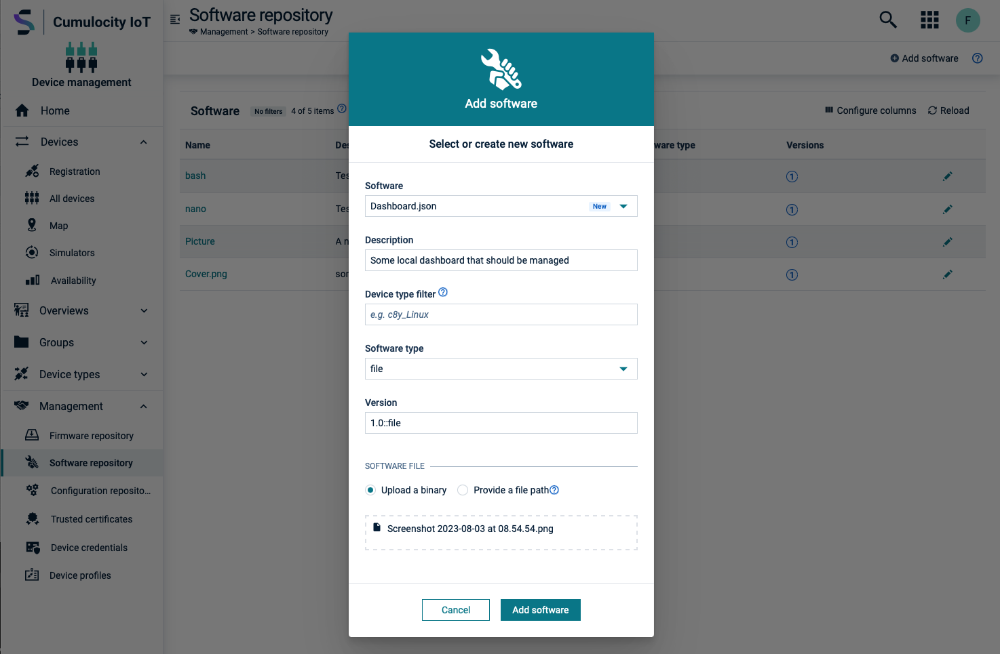

# thin-edge.io file-management plugin


## Overview

This software management plugin enables the **thin-edge.io** to manage files on the device. It uses the [thin-edge.io file-management API](https://thin-edge.github.io/thin-edge.io/references/plugin-api/) to list, install and remove files from one folder. The folder is configurable via the `file-management.json` file. The plugin also supports the management of file versions. The plugin creates a file `.c8y` in the folder that is managed. The file contains the version of the files that are currently installed on the device. If the version is not present the reported version will be 0.0

## Prerequisites

- thin-edge.io installed on the device
- Access rights to the folder where the files should be managed

## Installation

### 1. Add config file

Add the `file-management.json` file to the device. The Plugin expects the file to be located at `/etc/tedge/c8y/file-management.json`. The plugin expects the file to be json with the following fields:

```bash
sudo nano /etc/tedge/c8y/file-management.json
```

```json
{
  "folder": "/path/to/folder",
  "versionFile": ".c8y",
  "logFile": "/var/log/tedge/file-management"
}
```

- **folder**: The folder that should be managed by the thin-edge.io. The folder must exist on the device.
- **versionFile**: The file that contains the version of the files that are currently installed on the device. The file will be created by the plugin if it does not exist.
- **logFile**: The folder where the log files should be stored.

### 2. Check access rights of config file

Make sure that the file-management.json file is readable by the thin-edge.io.

```bash
sudo chmod 644 /etc/tedge/c8y/file-management.json
```

### 3. Add executable to thin-edge sm plugins

Add the plugin `files` to the thin-edge sm-plugins. The executable (plugin) must be located at `/etc/tedge/sm-plugins/file`.
Run the following command. Change the architecture if needed.

```bash
curl -s https://api.github.com/repos/scfx/tedge-file-management-plugin/releases/latest \
| grep "browser_download_url.*linux_amd64.*\.tar\.gz" \
| cut -d : -f 2,3 \
| tr -d \" \
| sudo wget -qi - -O tedge-file-management-plugin.tar.gz \
&& sudo tar -xzf tedge-file-management-plugin.tar.gz \
&& sudo rm tedge-file-management-plugin.tar.gz \
&& sudo cp tedge-file-management-plugin /etc/tedge/sm-plugins/file \
&& sudo rm tedge-file-management-plugin
```

### 4. Check access rights of plugin

Make sure that the plugin is executable by the thin-edge.io.

```bash
sudo chmod 755 /etc/tedge/sm-plugins/file
```

### 5. Optional: Manage the file-management.json file via thin-edge.io

Add the file-mangement.json file to the configurations files that can be managed via thin-edge.io. Follow this guide to enable the configuration management (https://thin-edge.github.io/thin-edge.io/start/getting-started/#step-6-manage-configuration-files)[Link to the thin-edge.io documentation] and edit the file: `/etc/tedge/c8y/c8y-configuration-plugin.toml`

```toml
    files = [
    ...
    { path = '/etc/tedge/c8y/file-management.json', type = 'file-management.json' },
    ...
    ]
```

### 6. Optional: Manage the log files via thin-edge.io

Optional: Add the log files to the thin-edge.io so that the logs can be access via Cumulocity IoT. Follow this guide to enable log file management (https://thin-edge.github.io/thin-edge.io/start/getting-started/#step-7-manage-log-files) [Link to the thin-edge.io documentation] and edit the file: `/etc/tedge/c8y/c8y-log-plugin.toml`

```toml
    files = [
    ...
    { type = 'file-management', path = "/var/log/tedge/file-management/file-mgmnt-*" },
    ...
    ]
```
### 7. Restart the thin-edge.io service
Restart the thin-edge.io service via

```bash
sudo tedge disconnect c8y
```

And

```bash
sudo tedge disconnect c8y
```

## Usage

Files can be added to your software repository via in the Cumulocity IoT Application Device Management. As convention the software type must be added to the version. So version `1.0` is not valid but `1.0::file` is valid. The plugin will only install files that have the version ending `::file`.


## Development

### Build

```bash
GOOS=linux GOARCH=amd64 go build -o file
```

### Run locally

The default path of the config file is `/etc/tedge/c8y/file-management.json`. You can change the path via the `--config` flag if you want to run locally

```bash
go build && ./file-management list --config ../file-management.json
```
